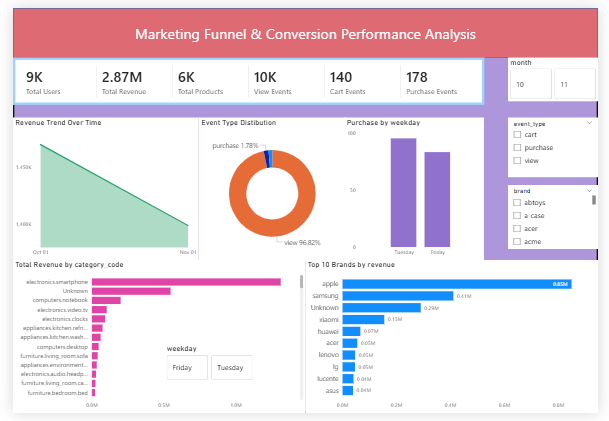

# Marketing Funnel & Lead Conversion Analysis

## Project Overview

This project focuses on analyzing customer behavior across a marketing funnel to understand how users move through different stages:

**Visitors → Leads → Customers**

The analysis identifies conversion rates, funnel drop-offs, customer engagement patterns, and business opportunities to improve overall marketing and sales performance.

---

# Project Objectives

- Analyze customer journey across funnel stages
- Measure conversion rates between stages
- Identify major drop-off points in the funnel
- Analyze product category and brand performance
- Generate actionable business recommendations
- Build an interactive Power BI dashboard for business insights

---

# Tools & Technologies Used

- Python
- Pandas
- NumPy
- Matplotlib
- Jupyter Notebook
- Power BI
- VS Code

---

# Dataset Information

The dataset contains customer interaction data collected from an e-commerce platform.
This dataset contains 10,000 Rows and 12 Columns

### Important Features

| Column Name | Description |
|---|---|
| event_time | Timestamp of customer activity |
| event_type | User action (view/cart/purchase) |
| product_id | Product identifier |
| category_code | Product category |
| brand | Product brand |
| price | Product price |
| user_id | Unique user ID |
| user_session | Session identifier |

---

# Funnel Mapping

| Funnel Stage | Event Type |
|---|---|
| Visitor | View |
| Lead | Cart |
| Customer | Purchase |

---

# Project Workflow

## 1. Data Cleaning
- Removed duplicate records
- Handled missing values
- Converted date columns into datetime format
- Created additional time-based features

## 2. Funnel Analysis
- Calculated visitor-to-lead conversion
- Calculated lead-to-customer conversion
- Measured overall funnel conversion
- Identified funnel drop-offs

## 3. Business Analysis
- Analyzed top-performing categories
- Identified high-revenue brands
- Evaluated customer purchase behavior
- Performed time-based activity analysis

## 4. Dashboard Development
Created an interactive Power BI dashboard including:
- KPI Cards
- Funnel Chart
- Conversion Analysis
- Category Insights
- Brand Performance
- Interactive Filters & Slicers

---

# Key Insights

## Funnel Insights
- A significant number of users visited product pages but did not proceed to the cart stage.
- Funnel drop-offs indicate potential issues in customer engagement and purchase intent.
- Cart-to-purchase conversion shows opportunities to optimize the checkout process.

## Product Insights
- Some product categories generated high traffic but low purchase conversions.
- High-performing brands contributed significantly to overall revenue.
- Certain categories demonstrated better customer purchase behavior than others.

## Customer Behavior Insights
- User activity increased during specific time periods and peak hours.
- Customer engagement patterns suggest opportunities for targeted marketing campaigns.

---

# Business Recommendations

## Improve Visitor → Lead Conversion
- Improve product page design and UI/UX
- Add stronger call-to-action buttons
- Provide discounts and promotional offers
- Improve website speed and navigation

## Improve Lead → Customer Conversion
- Simplify the checkout process
- Reduce cart abandonment
- Provide trust badges and customer reviews
- Send cart reminder notifications

## Marketing Optimization
- Focus marketing efforts on high-converting categories
- Retarget users who abandoned carts
- Invest more in high-performing products and brands
- Optimize campaigns during peak engagement periods

---

# Power BI Dashboard Features

The interactive dashboard includes:

- KPI Cards
- Funnel Visualization
- Conversion Rate Analysis
- Top Categories Analysis
- Brand Revenue Analysis
- Time-Series Trends
- Interactive Slicers & Filters

---

# 📷 Dashboard Preview


---

# Project Structure

---

```text
FUTURE_DS_03/
|
├── Dashboard/
│   ├── Funnel_dashboard.png
│   └── PowerBI_dashboard.pbix
|
├── Data/
│   ├── marketing_funnel_sample.csv
│   └── cleaned_marketing_funnel.csv
│
├── notebooks/
│   ├── 01_data_cleaning.ipynb
│   ├── 02_funnel_analysis.ipynb
│
├── Report/
│   └── Marketing_Funnel_Report.pdf
|
├── README.md

